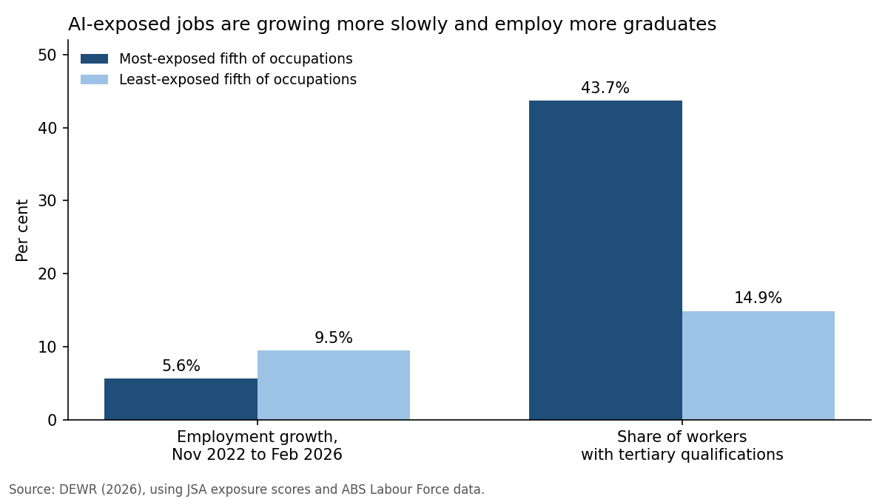

# Early Warning, Early Action: An AI Workforce Adjustment Package for Australia

**Client and policy process:** This brief advises the Deputy Secretary, Workplace Relations, Department of Employment and Workplace Relations (DEWR), as input to the AI Employment and Workplaces Forum's September 2026 consultations on best-practice workplace AI guidance (Armstrong 2026; Rishworth 2026a) and DEWR's National AI Plan gap analysis (Rishworth 2026b).

---

## Executive Summary

Generative AI is not causing broad job losses in Australia, but an early signal has emerged: since November 2022, employment in the most AI-exposed fifth of occupations grew 5.6%, against 9.5% in the least-exposed fifth (DEWR 2026). Adjustment appears to be running through slower hiring in clerical work, where women are over-represented. Guidance builds trust but cannot fund retraining or cushion income losses; waiting for mass displacement means designing programs in a crisis. Four options and the status quo are scored against five weighted criteria. The brief recommends a staged package: monitoring triggers, an AI consultation standard with a job redesign fund, AI Transition Skills Accounts, and a trigger-activated wage insurance pilot, costing about $440 million over four years, under 0.4% of the $116 billion gain the Productivity Commission (PC) projects.

---

## 1. Problem Definition and Context

A task-based model identifies three channels (Acemoglu and Restrepo 2019):

| Channel | Mechanism | Australian evidence |
|---|---|---|
| Displacement | AI takes over tasks, cutting demand for those workers | Clerical tasks that survived earlier automation are now exposed (JSA 2025a) |
| Augmentation | AI raises productivity in tasks it cannot fully perform | Augmentation generally outweighs automation (JSA 2025b) |
| Reinstatement | New tasks and roles emerge | Software developer jobs up 25% since November 2022 (DEWR 2026) |

The net effect is uncertain: the PC (2025) projects about $116 billion of extra GDP over a decade, but Acemoglu (2025) estimates productivity gains below 0.66% over ten years and a rising capital share. 'So-so' automation, displacing workers while barely cutting costs, lowers labour demand with no offsetting gain (Acemoglu and Restrepo 2019). Either way, action is justified: large gains create resources to share; small gains mean displacement without growth.

With unemployment at 4.5% (ABS 2026), the problem is distribution, not mass unemployment: gains accrue to firms and AI-complementary workers while exposed workers bear the costs. The Forum's guidance will address worker transitions (Rishworth 2026a), but cannot fix three market failures: credit constraints deter retraining, poaching risk deters employer training, and workers cannot see which tasks are exposed.

---

## 2. Analysis of Impacts

*Figure 1. Source: DEWR (2026).*

**Employment.** DEWR (2026) finds a small negative link between exposure and employment growth, most visible in clerical roles. In a tight market, firms adjust through attrition and fewer vacancies, so costs fall first on would-be entrants: exposed US 22 to 25-year-olds saw a 16% relative employment decline (Brynjolfsson et al. 2025a), though Australian youth outcomes have held up (DEWR 2026).

**Tasks.** Exposure varies within occupations (JSA 2025b), so most roles will be redesigned, not removed, ideally with workers' input (JSA 2025a). With 15% of workers changing occupation yearly (JSA 2025c), gradual change is absorbable if skills are portable.

**Wages.** AI assistance raised customer-support productivity by 15%, most for less-experienced workers (Brynjolfsson et al. 2025b), which can compress pay gaps. But productivity becomes pay only where workers have bargaining power; early US adjustment ran through jobs, not wages (Brynjolfsson et al. 2025a).

**Industry.** Adoption is uneven across firms (OECD 2023). Scale economies in data and computing may concentrate gains in large firms and capital income (Acemoglu 2025). Small and medium enterprise (SME) adoption and data-access reform (PC 2025) are therefore labour policy too.

**Distributional lens.**

| Group | Evidence | Implication |
|---|---|---|
| Women | 56.3% of the most-exposed fifth versus about 30% of the least-exposed (DEWR 2026); nearly three times men's rate of high exposure in high-income countries (Gmyrek et al. 2025) | This wave hits women hardest |
| Tertiary-qualified | 43.7% versus 14.9% (DEWR 2026) | Low-skill programs miss them |
| Mid-career | Displaced long-tenure workers lose about 1.4 years of earnings (Davis and von Wachter 2011) | Support should reward fast re-employment |
| Young entrants | Fewer entry-level hires | Monitoring must track entry-level vacancies |

---
